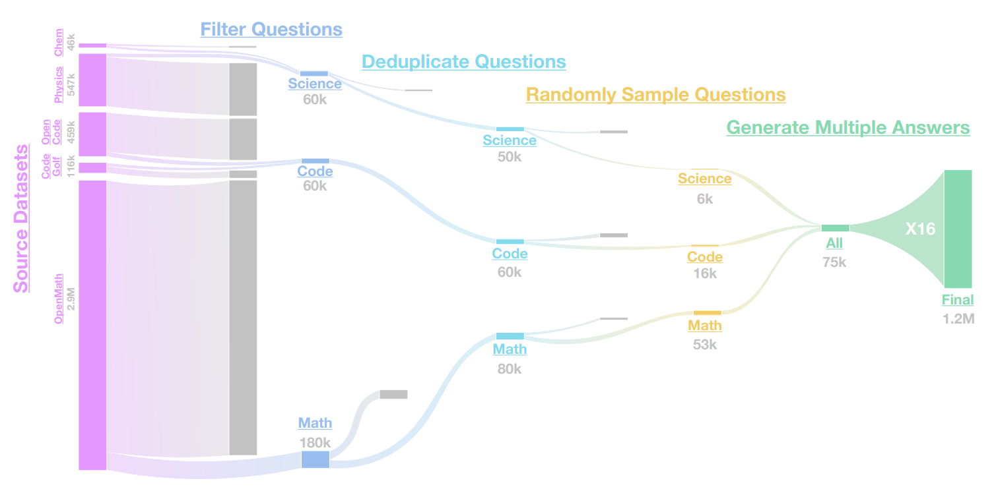

## OpenThoughts3-1.2M

The OpenThoughts3-1.2M dataset was used to train the OpenThinker3-7B model. The dataset can be found on [HuggingFace](https://huggingface.co/datasets/open-thoughts/OpenThoughts3-1.2M). It is a combination of 850k math samples, 250k code samples, and 100k science samples. We generate the data by sourcing questions from various datasets, processing them through our pipeline and annotating them using QwQ-32B.

<picture>
    <!-- <source media="(prefers-color-scheme: light)" width="100%" srcset="../images/openthoughts3-diagram.png"> -->
    
</picture>

Further details on this dataset can be found in our [paper](https://arxiv.org/abs/2506.04178) and in our [blog post](https://www.open-thoughts.ai/blog/ot3).

## Data Generation

### Setup 
Using built-in python package management:
`uv` is one of the requirements and is used to compile the remote requirements file.
```
python3 --version
python3 -m venv .venv --prompt dcft
source .venv/bin/activate
pip install -r requirements.txt
```

### Run pipeline

List available pipelines (optional)
```bash
python -m dcft.generate --list --dev
```

Run framework locally (try small test to rapidly debug)

```bash
    python -m dcft.generate  --framework <name of framework> --dev
```

Run framework on cluster

```bash
    python -m dcft.generate  --framework <name of framework> --remote
```

More about data generation in [dcft/README.md](dcft/README.md)

### Troubleshooting Data Generation

Cancel a ray job (replace the job id):

```
RAY_ADDRESS=http://34.71.168.41:8265 ray job stop raysubmit_nL1eLaL27BW7C5rj
```

Delete framework cache for a given framework (useful if the cache has corrupted data)

```bash
python -m dcft.delete_cache --framework <framework_name>
```

## Training

Training uses [LLaMA-Factory](https://github.com/hiyouga/LLaMA-Factory) as a subtree. Each training run can be described by a config file, which outlines the hyperparameters, base model, dataset, etc.

```bash
python3 -m hpc.launch --train_config_path dcft/train/hp_settings/paper/reasoning_medium.yaml --time_limit 24:00:00 --num_nodes 16 --dataset mlfoundations-dev/EXPERIMENT_NAME_HERE
```

[See more here](https://github.com/mlfoundations/dcft_private/tree/main/hpc#main-command)

See the [configs](dcft/train/configs) folder for more examples. We highly recommend using presets with the `include_hp:` flag. Additional details can be found in the [training README](dcft/train/README.md).

## Evaluation

We use [evalchemy](https://github.com/mlfoundations/evalchemy/tree/main) for evaluations. First clone evalchemy then run the following:

### Running evaluations with Evalchemy

Pipeline eval (no held out)
```bash
python eval/distributed/launch_simple.py --tasks AIME24,AMC23,MATH500,MMLUPro,JEEBench,GPQADiamond,LiveCodeBench,CodeElo,CodeForces --num_shards 16 --max-job-duration 4 --model_name "mlfoundations-dev/EXPERIMENT_NAME_HERE"
```

Full Eval (with held out)
```bash
python eval/distributed/launch_simple.py --tasks AIME24,AMC23,MATH500,MMLUPro,JEEBench,GPQADiamond,LiveCodeBench,CodeElo,CodeForces,AIME25,HLE,LiveCodeBenchv5 --num_shards 16 --max-job-duration 4 --model_name HF_ORG/HF_MODEL_HERE
```

[See more here](https://github.com/mlfoundations/evalchemy/tree/main/eval/distributed)